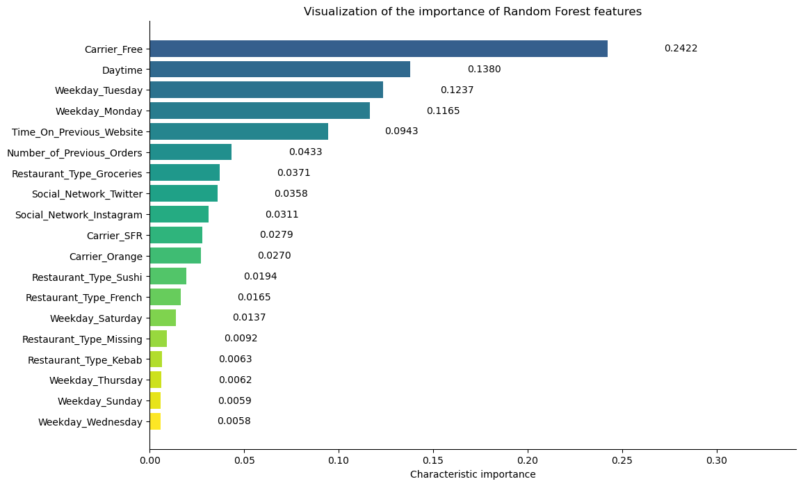
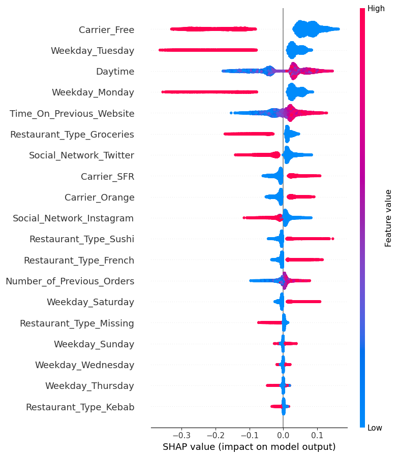

# Online Ad Click Conversion Predictor

> Binary classification pipeline predicting customer ad conversion from behavioral and contextual signals, with SHAP-based model interpretation and actionable campaign recommendations.

## Table of Contents
- [Project Overview](#project-overview)
- [Dataset](#dataset)
- [Feature Landscape](#feature-landscape)
- [Exploratory Analysis](#exploratory-analysis)
- [Modeling Strategy](#modeling-strategy)
- [Results](#results)
- [Model Interpretation](#model-interpretation)
- [Business Recommendations](#business-recommendations)

## Project Overview

This project builds a predictive model to identify customers most likely to click or convert after seeing an online advertisement, using ~18,000 observations of previously engaged users from a food delivery platform context.

Given the high baseline conversion rate (~80%), model evaluation prioritizes **recall** to minimize missed conversions rather than overall accuracy — reflecting the business cost asymmetry where false negatives are more costly than false positives.

Two complementary models were used:
- **Regularized Logistic Regression** — for interpretability and coefficient-based inference
- **Random Forest** — to capture non-linear relationships and feature interactions, validated via SHAP

**Final model: Regularized Logistic Regression — Test Recall: 0.98**

## Dataset

| Property | Value |
|----------|-------|
| Observations | ~18,000 |
| Target variable | `Click_Conversion` (binary: 1 = converted) |
| Baseline conversion rate | ~80% |
| Source | Retargeting-focused dataset of previously engaged users |

> The high baseline conversion rate means accuracy alone is misleading — a model predicting all 1s would score ~80% accuracy but provide no useful signal.

## Feature Landscape

Features are grouped into three meaningful categories:

### Static / Structural
Relatively stable features reflecting the user's environment:
- `Region`
- `Carrier`
- `Restaurant_Type`

### Behavioral / Engagement
Direct signals of historical user interaction:
- `Time_on_Previous_Website`
- `Number_of_Previous_Orders`

### Contextual / Timing
Timing and channel of ad exposure:
- `Daytime`
- `Weekday`
- `Social_Network`

## Exploratory Analysis

### Target & Feature Observations
- Conversion rate ≈ 80% → strong class imbalance; accuracy alone is not a suitable evaluation metric
- `Daytime` and `Time_on_Previous_Website`: roughly uniform distributions
- `Number_of_Previous_Orders`: right-skewed, median around 2–4; limited outliers (~1.3%)
- All categorical variables show balanced distributions with sufficient sample sizes per category

### Data Quality Issue
~10% missing values concentrated exclusively in `Restaurant_Type`, occurring **only when `Number_of_Previous_Orders = 0`**. This is likely business-driven (no order history → no restaurant type recorded) and was flagged for stakeholder validation. Data kept as-is for modeling.

### Key Feature–Target Relationships

| Feature | Finding |
|---------|---------|
| `Carrier_Free` | Systematically lower conversion likelihood |
| `Daytime` | Higher daytime intervals → higher conversion |
| `Time_on_Previous_Website` | Mild positive association with conversion |
| `Number_of_Previous_Orders` | Weaker but informative positive signal |
| `Weekday_Monday / Tuesday` | Consistently underperform vs other days |
| `Social_Network` | Facebook > Instagram > Twitter (moderate gaps) |
| `Region` | No discernible conversion differences → excluded from modeling |

### Feature Preparation
- Categorical variables encoded via one-hot encoding
- Reference categories dropped to avoid multicollinearity
- `Region` excluded from modeling due to lack of predictive signal
- Correlation analysis confirms weak feature-feature dependencies — no multicollinearity concerns

## Modeling Strategy

### Objective & Metric Choice

| Dimension | Decision |
|-----------|---------|
| Primary metric | Recall (minimize missed conversions) |
| Secondary metrics | Precision, overall accuracy |
| Rationale | Missing a potential converter is more costly than targeting a non-converter |

> Note: metric prioritization should be validated with business stakeholders before deployment.

### Model Selection

| Model | Role |
|-------|------|
| Regularized Logistic Regression | Primary model — coefficient-based interpretation, strong recall, powers business inference |
| Random Forest | Validation model — cross-checks feature importance, captures non-linear interactions via SHAP |

Both models were compared on feature importance rankings — dominant features overlap, increasing confidence in findings.

## Results

### Logistic Regression Performance
- **Recall: 0.98** (with L1 regularization)
- Features zeroed out by L1: `Weekday_Sunday`, `Weekday_Wednesday`, `Weekday_Thursday`, `Restaurant_Type_Kebab`

### Top Coefficients (Log-Odds)

**Positive drivers (increase conversion odds):**
| Feature | Coefficient | Odds Ratio |
|---------|------------|------------|
| Daytime | +0.8238 | ~2.28 |
| Time_on_Previous_Website | +0.5783 | ~1.78 |
| Number_of_Previous_Orders | +0.1354 | ~1.15 |
| Carrier_SFR | +0.1345 | ~1.14 |
| Carrier_Orange | +0.0967 | ~1.10 |

**Negative drivers (decrease conversion odds):**
| Feature | Coefficient | Odds Ratio |
|---------|------------|------------|
| Carrier_Free | −1.5266 | ~0.22 |
| Weekday_Monday | −1.1777 | ~0.31 |
| Weekday_Tuesday | −1.1630 | ~0.31 |
| Social_Network_Twitter | −0.6603 | ~0.52 |

> Interpretation example: A one standard deviation increase in `Daytime` is associated with ~128% higher odds of conversion, holding all other variables constant. `Carrier_Free` users have ~78% lower conversion odds compared to the reference carrier.

## Model Interpretation

### Random Forest — Feature Importance (MDI)
Top 5 features by mean decrease in impurity:
1. `Carrier_Free` (0.2422)
2. `Daytime` (0.1380)
3. `Weekday_Tuesday` (0.1237)
4. `Weekday_Monday` (0.1165)
5. `Time_on_Previous_Website` (0.0943)

These overlap with the top features identified by Logistic Regression, increasing confidence in the findings.

### SHAP Analysis

SHAP summary and dependence plots were used to assess feature direction and interaction effects.

#### SHAP Summary Plot
The summary plot shows the direction and magnitude of each feature's contribution across all predictions. Red = high feature value, Blue = low feature value.

**Key findings:**
- `Carrier_Free = 1` (red) strongly pushes predictions toward non-conversion; the effect is clean and monotonic
- `Weekday_Monday` and `Weekday_Tuesday` = 1 consistently push toward non-conversion
- `Daytime` and `Time_on_Previous_Website` show positive effects but with heterogeneity across users — interaction effects investigated below

#### SHAP Dependence Plot — Daytime × Carrier_Free

A clear threshold effect appears at `Daytime ≈ 0.4` (around noon). Above this threshold, SHAP values shift sharply positive. Notably, Free carrier users (pink/red) show higher SHAP values than non-Free users (blue) above the threshold — meaning **daytime exposure has a stronger predictive impact among Free carrier users**, despite their overall lower conversion rate.

#### SHAP Dependence Plot — Time on Previous Website × Carrier_Free

`Time_on_Previous_Website` shows a smooth monotonic positive relationship with conversion likelihood. Free carrier users (pink/red) consistently sit above non-Free users (blue) at equivalent engagement levels — confirming that **engagement signals interact with carrier status** rather than operating independently.

> **Core insight:** Conversion behavior is context-dependent. Engagement and timing signals do not affect all users uniformly — their impact is modulated by carrier status. One-size-fits-all campaigns are suboptimal.

## Business Recommendations

### 1. Carrier-Segmented Targeting
`Carrier_Free` is the strongest negative predictor across both models. Free carrier users likely proxy for greater price sensitivity.
- Allocate less budget to Free carrier users in conversion-focused campaigns
- Test alternative messaging focused on education and trust-building rather than direct conversion asks
- Delay conversion prompts for this segment; prioritize engagement funnels first

### 2. Engagement-Based Retargeting
Time on previous website and order history are strong positive signals.
- Implement engagement thresholds: if `Time_on_Previous_Website ≥ X` → trigger conversion push; if `< X` → prioritize content-first follow-up
- Consider tiered loyalty rewards and early-access programs for high-order-history users to maximize LTV

### 3. Time-Optimized Campaign Scheduling
Timing effects are significant but conditional on user segment.
- Reduce ad intensity on Monday and Tuesday (consistently lower conversion odds)
- Increase emphasis on weekends, particularly Saturday
- Reserve daytime slots (especially ≥ 0.4) for non-Free carrier, high-intent users
